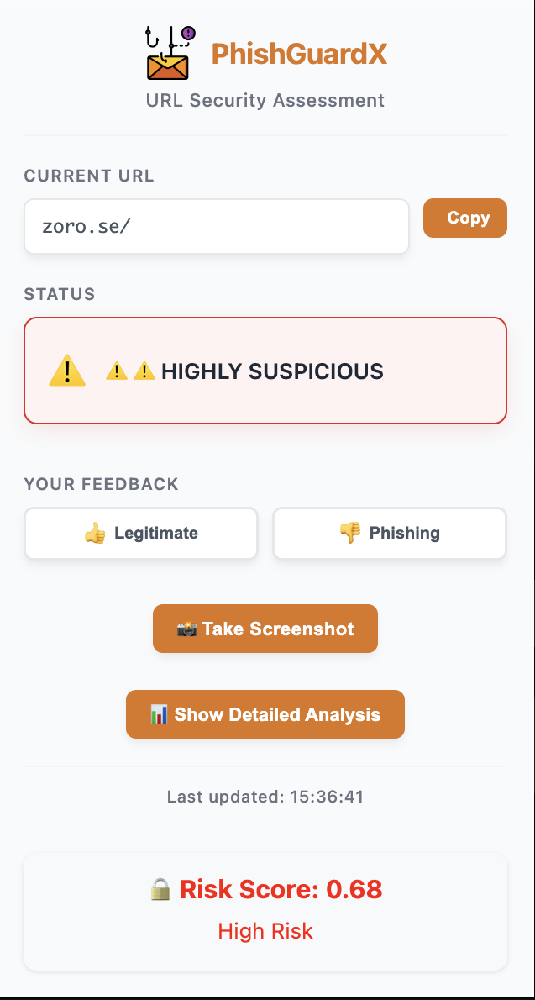
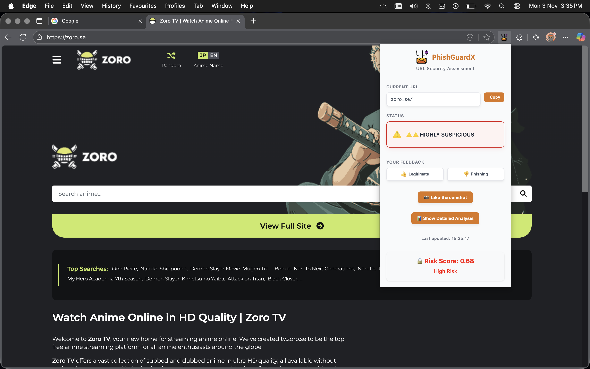
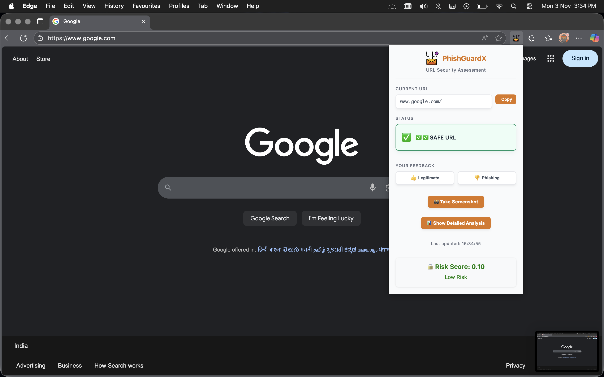
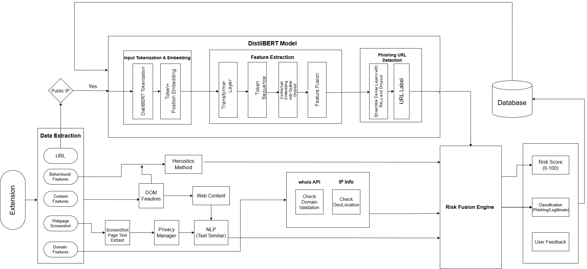

# PhishGuardX

### AI-Powered Phishing Detection Browser Extension
**PhishGuardX** is an intelligent cybersecurity tool that detects phishing websites in real time using **AI models, heuristic URL analysis, domain intelligence, and webpage inspection**.

It integrates a **Chrome browser extension** with an **AI-powered backend server** to provide instant phishing detection and security insights while browsing.

---

## Demo

<details>
<summary>Click to expand Demo</summary>

### Extension Popup
<p align="center">
  
</p>

### Phishing URL Detection
<p align="center">
  
</p>

### Safe URL Detection
<p align="center">
  
</p>

</details>


## URL Heuristic Analysis

Detects suspicious indicators such as:

* IP address domains
* Excessive subdomains
* Suspicious characters (`@`, `-`)
* Long URLs
* Non-standard ports

---

## DOM Security Inspection

Examines webpage structure:

* Hidden iframes
* Password input fields
* Suspicious scripts
* Anchor text mismatch
* External favicons

---

## Machine Learning Analysis

Backend AI models evaluate:

* Phishing language patterns
* Webpage structure
* Layout similarity to phishing templates

---

## Risk Score System

| Score       | Risk Level        |
| ----------- | ----------------- |
| 0 – 0.24    | Safe              |
| 0.25 – 0.39 | Suspicious        |
| 0.40 – 0.59 | Highly Suspicious |
| 0.60 – 1.0  | Phishing          |

---

## Screenshot Capture

Users can capture the current webpage for analysis or evidence.

---

## User Feedback

Users can mark sites as:

* Legitimate
* Phishing

This can help improve future models.

---

# Architecture

<p align="center">
  
</p>


```
User Browser
     │
     ▼
Chrome Extension
(Content Script)
     │
     │ Extract Features
     ▼
Background Service Worker
     │
     │ Send Request
     ▼
Backend API Server
     │
     ├─ URL Heuristic Analyzer
     ├─ Domain Intelligence
     ├─ NLP Phishing Detection
     ├─ Visual Page Analysis
     │
     ▼
Risk Score + Verdict
     │
     ▼
Extension Popup UI
```

---

# Project Structure

```
PhishGuardX
│
├── manifest.json
├── background.js
├── content.js
│
├── popup.html
├── popup.css
├── popup.js
│
├── icons/
│   ├── icon16.png
│   ├── icon32.png
│   ├── icon48.png
│   └── icon128.png
│
├── docs
│   ├── screenshots
│   │   ├── PhishGuardX.jpg
│   │   ├── final_output_phishing.jpg
│   │   └── final_output_safe.jpg
│   └── system_Architecture.jpg
│
└── server/
    ├── fast_server.py
    ├── deep_server.py
    ├── requirements.txt
    ├── package.json
    └── output.csv
```

---

# Installation Guide

## 1 Clone Repository

```bash
git clone https://github.com/balanGH/PhishGuardX.git
cd PhishGuardX
```

---

# Backend Setup

Navigate to the server folder:

```bash
cd server
```

Install dependencies:

```bash
pip install -r requirements.txt
```

Start the detection server:

```bash
python fast_server.py
```

Server runs on:

```
http://localhost:8081
```

---

# Chrome Extension Setup

1. Open Chrome
2. Navigate to:

```
chrome://extensions
```

3. Enable **Developer Mode**
4. Click **Load Unpacked**
5. Select the **PhishGuardX folder**

The extension will now appear in the browser toolbar.

---

# API Example

### Request

```
/detect?url=example.com
```

### Response

```json
{
  "url": "example.com",
  "status": "success",
  "analysis": {
    "risk_score": 0.35,
    "verdict": "⚠️ SUSPICIOUS",
    "timestamp": "2026-03-08T11:49:41.740467"
  },
  "html_result": "<div>Comprehensive phishing analysis report...</div>"
}
```

---

# Technology Stack


## Frontend

* HTML
* CSS
* JavaScript
* Chrome Extension Manifest V3

---

## Backend

* Python
* FastAPI
* Requests
* BeautifulSoup

---

## Machine Learning

* Transformers (DistilBERT)
* CNN for visual detection

---

# Security Techniques Used

* URL anomaly detection
* Typosquatting detection
* Domain age analysis
* SSL validation
* Webpage structure analysis
* Machine learning phishing classification

---

# Future Improvements

* Real-time phishing blacklist integration
* Browser warning overlays
* Chrome Web Store deployment
* Dataset-based ML training
* Visual phishing similarity detection

---

# Contributing

Contributions are welcome.

1. Fork the repository
2. Create a new branch
3. Submit a pull request

---
# License

This project is licensed under the **MIT License**.

---

# Authors

* **balanGH** – https://github.com/balanGH

---

# Contributors

Thanks to these amazing contributors:

* **lashmie** – https://github.com/lashmie
* **vivamuss** – https://github.com/vivamuss
* **shrinigashthiyagarajan** – https://github.com/shrinigashthiyagarajan


<a href="https://github.com/balanGH/PhishGuardX/graphs/contributors">
  
</a>
